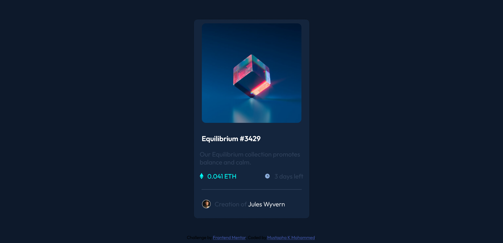

# Frontend Mentor - NFT preview card component solution

This is a solution to the [NFT preview card component challenge on Frontend Mentor](https://www.frontendmentor.io/challenges/nft-preview-card-component-SbdUL_w0U). Frontend Mentor challenges help you improve your coding skills by building realistic projects. 

## Table of contents

- [Overview](#overview)
  - [The challenge](#the-challenge)
  - [Screenshot](#screenshot)
  - [Built with](#built-with)
  - [Continued development](#continued-development)
  - [Author](#Author)
- [Acknowledgments](#acknowledgments)

**Note: Delete this note and update the table of contents based on what sections you keep.**

## Overview

### The challenge

Users should be able to:

- View the optimal layout depending on their device's screen size
- See hover states for interactive elements

### Screenshot

### Built with

- Semantic HTML5 markup
- CSS custom properties
- Flexbox

### Continued development

This project has helped me realised areas where i'm lacking such as flexbox and css grid and i would focus on those areas.

### Author

- Frontend Mentor - [@mmustaphak](https://www.frontendmentor.io/profile/mmustaphak)
- Twitter - [@mmustaphak1](https://www.twitter.com/mmustaphak1)

## Acknowledgments

I would like to acknowledge a friend and mentor who has guided me on my project and i hope to work on more projects with him. His known as Ridollah Esin Abdulrazaq, the link to his twiiter will be down below.

-Twitter - [@esinnation](https://www.twitter.com/esinnation)
